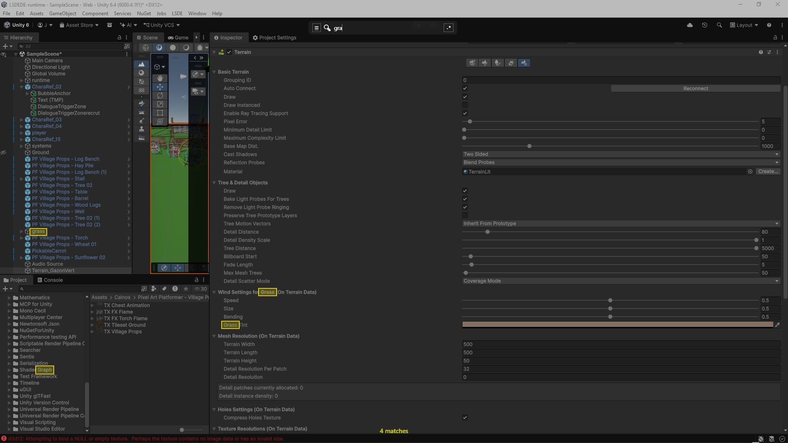

# ScreenSearchOverlay

Press **Ctrl+Alt+F**, search any text visible on screen with OCR, click to copy. Like Ctrl+F for the whole screen.


[](preview.jpg)

## Shortcuts

| | |
|---|---|
| `Ctrl+Alt+F` | Open overlay (global hotkey) |
| Type | Highlight matching text |
| Click match | Copy word to clipboard |
| `Mouse wheel` | Scroll the app underneath; overlay re-captures when you stop |
| `Escape` / `Right-click` | Close overlay |
| `↑` / `↓` | Search history |
| `Enter` | Save current search to history |
| Drag search bar | Move it (position persisted) |

Right-click inside the search box itself still opens the native paste menu.

## Features

- **OCR search** — `Windows.Media.Ocr`, multi-language (pick from tray icon)
- **Scroll-through** — wheel anywhere on the overlay scrolls the app below natively (works with Chromium/Electron). Overlay reappears with a fresh capture when you stop.
- **Regex** — toggle `.*` button
- **Copy all / copy matched** — hamburger menu
- **Zen mode**, **highlight size**, **search bar size** — hamburger menu, persisted

## Install

Download `ScreenSearchOverlay.exe` from the [latest release](../../releases/latest). Self-contained, portable.

## Build

```powershell
.\build.ps1 -Run       # build + launch
.\build.ps1            # build to dist/
.\build.ps1 -Release   # build + GitHub release
```

Version lives in `ScreenSearchOverlay.csproj` (`<Version>`).

To enable diagnostic logging at `%TEMP%\ls-ocrlayout-scroll.log`, add `<DefineConstants>LS_DEBUG_LOG</DefineConstants>` to the csproj. Off by default — `[Conditional]` strips the calls completely in release.

## Code layout

`MainWindow` is split into partial files by concern:

| File | Responsibility |
|---|---|
| `MainWindow.xaml.cs` | ctor, lifecycle, fields, log |
| `MainWindow.Scroll.cs` | scroll state machine + global hook handler |
| `MainWindow.Capture.cs` | screen capture, `WriteableBitmap` swap, OCR pipeline + cache |
| `MainWindow.Search.cs` | search box, regex, hamburger menu, highlights |
| `MainWindow.SearchBar.cs` | drag, position, size, key nav, close handlers |
| `MainWindow.NativeInterop.cs` | Win32 P/Invoke + helpers (`SetClickThrough`, `InjectMouseWheel`, …) |
| `LowLevelMouseHook.cs` | `WH_MOUSE_LL` on a dedicated thread (per MSDN guidance — UI-thread hooks risk silent detachment past `LowLevelHooksTimeout`) |
| `App.xaml.cs` | global hotkey, tray icon, settings/history persistence |

### Scroll-through architecture

State machine `Idle ↔ Scrolling`. On the first wheel, the window goes `WS_EX_TRANSPARENT` (click-through Win32) and injects the wheel via `SendInput` so it lands on the app below. Subsequent wheels go natively to that app — Chromium-friendly because we never use synthetic `WM_MOUSEWHEEL`. A `WH_MOUSE_LL` hook on a dedicated thread keeps the debounce alive while we don't receive any events. After 400 ms of wheel silence: re-capture, refresh OCR, restore the overlay.

## Files written

- `settings.json` — zen mode, highlight size, search bar size & position
- `search-history.json` — last 50 searches

Both live next to the .exe.

## Requirements

Windows 10 build 19041+ or Windows 11. At least one OCR language pack (your system language is usually pre-installed).
