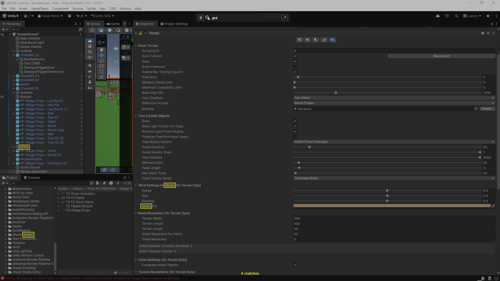
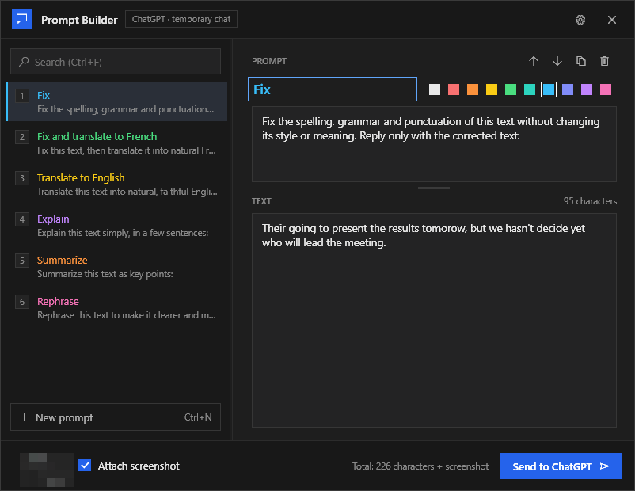

# ScreenSearchOverlay

Ctrl+F for your whole screen, plus ChatGPT one keystroke away.

- **Ctrl+Alt+F** — search any text visible on screen (OCR), click a match to copy it. **文A** translates the whole screen in place, in any app.
- **Ctrl+Alt+G** — send the selected text to ChatGPT with one of your saved prompts.


[](preview.jpg)

## Install

Download `ScreenSearchOverlay.exe` from the [latest release](../../releases/latest) and run it. Portable, nothing to install. It updates itself: when a new version is out, click **Version x.y.z available** in the Prompt Builder.

## Screen search — Ctrl+Alt+F

| | |
|---|---|
| Type | Highlight matches (`.*` for regex) |
| Click a match | Copy it |
| `文A` | Translate the screen (French by default, `translateTarget` in `settings.json`) |
| Mouse wheel | Scroll the app underneath |
| `↑` / `↓` | Search history |
| `Esc` / right-click | Close |

The ☰ menu copies all text, and sets zen mode and sizes. OCR languages are in the tray menu.

**Japanese or other Asian text?** Windows needs that language's OCR pack. From an admin PowerShell:

```powershell
Add-WindowsCapability -Online -Name "Language.Basic~~~ja-JP~0.0.1.0"
Add-WindowsCapability -Online -Name "Language.OCR~~~ja-JP~0.0.1.0"
```

## Prompt Builder — Ctrl+Alt+G

[](prompt-builder.png)

Select text anywhere, press **Ctrl+Alt+G**, pick a prompt, **Send**. ChatGPT opens in its own window with your prompt and text (and the screenshot, if ticked).

| | |
|---|---|
| Type, `↑` / `↓` | Find and pick a prompt |
| `Enter` / `Ctrl+Enter` | Send |
| `Ctrl+1`…`9` | Pick the n-th prompt |
| `Ctrl+N` / `Ctrl+D` | New / duplicate |
| `Alt+↑` / `Alt+↓` | Reorder |
| `Del` | Delete (with undo) |

Prompts are edited in place and saved as you type. **⚙** holds the language (English / Français), the theme (dark / light / Night Dev / VS Code), temporary chat, automatic send (text / with an image), clipboard image first (use your Win+Shift+S capture instead of a new screenshot), text size and updates.

### Add prompts from an AI agent (MCP)

Tick **⚙ > MCP server**: the window shows the line to give your agent once, e.g. for Claude Code:

```
claude mcp add --scope user --transport http ls-ocrlayout http://localhost:47821/mcp
```

Then ask the agent "add a prompt that…": it appears in the Prompt Builder right away. The agent can list, add and edit prompts, never delete them. The server only answers this computer and is off at every start.

## Privacy

Nothing leaves your machine while you search. **文A** sends the screen's text to Google Translate; **Send** sends your message (and screenshot) to ChatGPT. Your ChatGPT login stays in `ScreenSearchOverlay.WebView2/`, next to the exe.

## What's new

See [CHANGELOG.md](CHANGELOG.md).

## Build

```powershell
.\build.ps1 -Run       # build + launch
.\build.ps1 -Release   # build + GitHub release (bump the version in package.json first)
```
